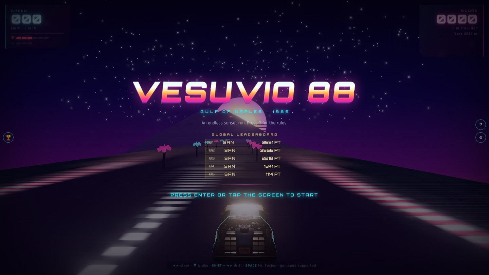

# VESUVIO 88

An endless synthwave racer set on the Gulf of Naples at sunset, built with
[Three.js](https://threejs.org/). Drive a DeLorean past Mount Vesuvius, collect
grapes for combos, grab a pizza for invincibility, and hit 88 mph for a time jump.

**▶️ Play: https://Santein.github.io/Vesuvio-88/**



## Controls

| Action | Keyboard | Gamepad |
| --- | --- | --- |
| Steer | ◄ ► / A D | Left stick or D-pad |
| Brake | ▼ / S | LT, B or D-pad down |
| Drift | Shift + ◄ ► | LB / RB |
| Mr. Fusion boost (+50 km/h) | Space | A |
| Start / restart | Enter or Space | Start or A |
| Settings | ⚙ button | — |

Touch controls appear automatically on phones and tablets.

## Features

- Procedurally curved, rolling road with centrifugal cornering
- Rival traffic, obstacles, grape combos, pizza invincibility power-up
- Soda cans grant an extra life, up to a maximum of six
- Pizza stacks: 10s fresh, +5s if taken while already invincible, with a 3-2-1 countdown
- Collectible Mr. Fusion reactors (hold up to 3) used as a NOS-style boost
- 88 mph "Salto Temporale" — Back to the Future style time jump with a +20 m skip
- Near misses: squeeze past a rock or a car without touching it for +2 points
- Speed lines at high velocity, and a hyperspace star warp through every time jump
- Fully procedural audio (Web Audio API): engine, tyre scrub, three synthwave tracks
- Italian / English, with separate music and SFX volume sliders
- Global top-5 leaderboard (Supabase) with arcade 3-letter initials entry, and an offline local fallback

## Running locally

The game loads a `.glb` model, which browsers refuse to fetch from `file://`.
Serve the folder over HTTP instead:

```bash
python3 -m http.server 8000
```

Then open <http://localhost:8000/>.

## Credits

- DMC DeLorean (Back to the Future Part II) model by
  [blair2819](https://sketchfab.com/3d-models/dmc-delorean-back-to-the-future-part-ii-a7aace485fb2419985b6a071c7c1005c)
  — licensed **CC BY-NC 4.0** (attribution required, non-commercial use only).
- Fonts: [Orbitron](https://fonts.google.com/specimen/Orbitron) and
  [Rajdhani](https://fonts.google.com/specimen/Rajdhani) via Google Fonts.
- Three.js loaded from the unpkg CDN.

Made by [Santein](https://linktr.ee/santo.gaglione).

*In loving memory of Kesama, Caballeros Studio.*
